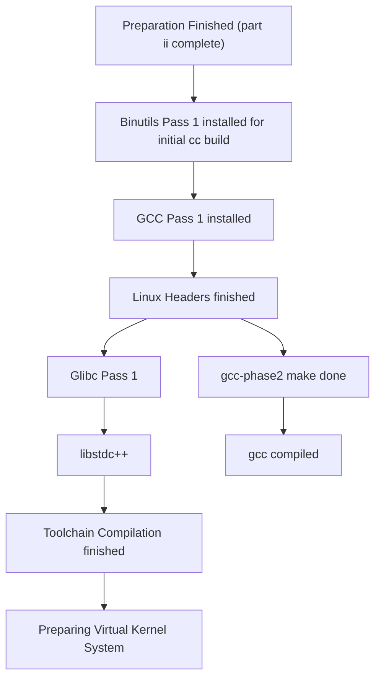

# To track VM snapshots

> NEVER UPGRADE OR UPDATE THE BUILD SYSTEM!!! 

```mermaid
flowchart TD;
    A["Preparation Finished (part ii complete)"]
    B["Binutils Pass 1 installed for initial cc build"]
    C["GCC Pass 1 installed"]
    D["Linux Headers finished"]
    E["Glibc Pass 1"]
    F["libstdc++"]
    G["Toolchain Compilation finished"]
    H["Preparing Virtual Kernel System"]

    D2["gcc-phase2 make done"]
	C2[gcc compiled]
    A --> B --> C --> D --> E --> F --> G --> H;
    D --> D2 --> C2;
```